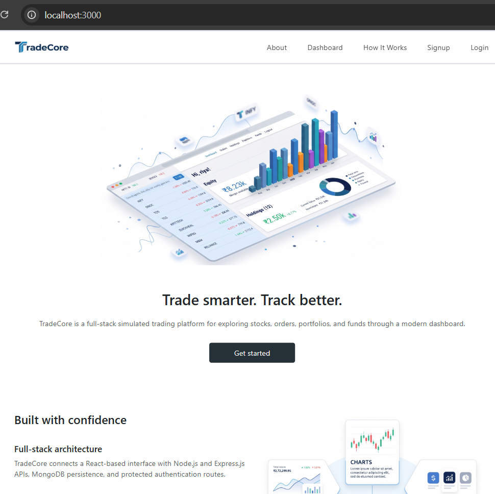
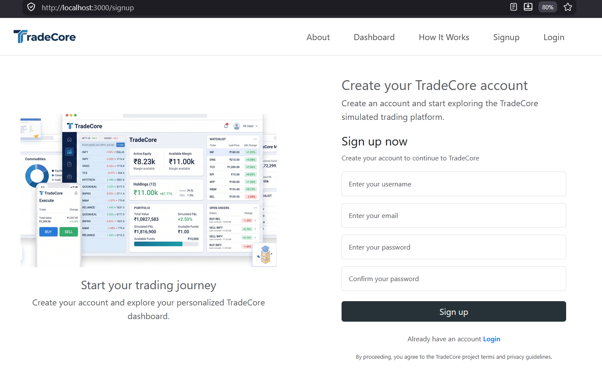
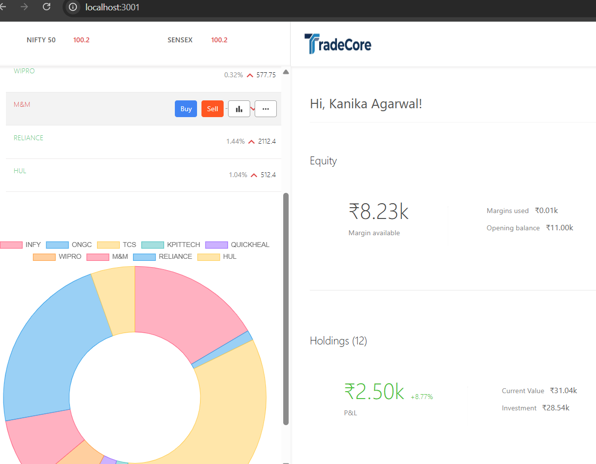
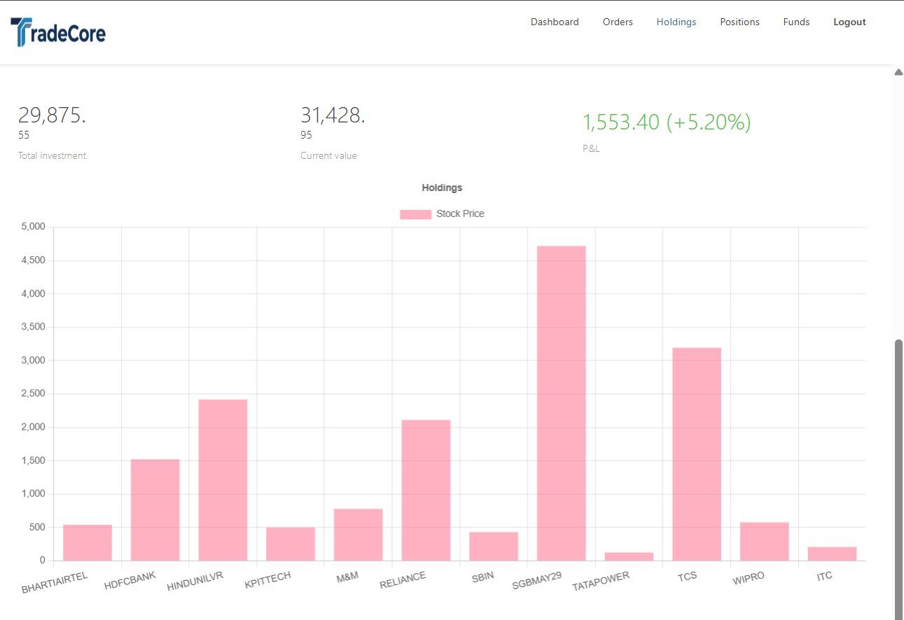
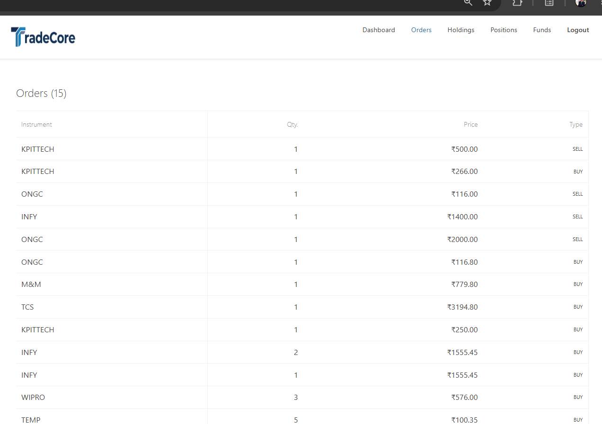
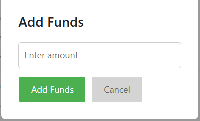

# TradeCore — Full-Stack Stock Trading Platform

TradeCore is a full-stack stock trading simulation platform built with the MERN stack. It provides an authenticated trading dashboard where users can manage funds, place simulated buy/sell orders, track holdings and positions, and monitor portfolio performance through profit/loss calculations.

The project focuses on implementing a complete full-stack workflow with authentication, REST APIs, database integration, protected routes, trading operations, and dashboard-based portfolio analytics.

> **Note:** TradeCore is an educational trading simulation project. It does not execute real stock-market transactions or provide real brokerage services.

---

## 🚀 Key Features

### 🔐 User Authentication
- User registration and login
- Password hashing using bcrypt
- JWT-based authentication
- HTTP-only cookie-based session handling
- Protected dashboard routes
- Authentication verification through backend middleware
- Logout functionality

### 📊 Trading Dashboard
- Centralized trading dashboard
- Watchlist for tracked stocks
- Stock price and quantity information
- Simulated buy/sell workflow
- Order management
- Holdings and positions tracking
- Funds management

### 💼 Holdings & Portfolio Analytics
- Track owned stocks and quantities
- Calculate investment value using average purchase price
- Calculate current holdings value
- Calculate profit/loss
- Calculate profit/loss percentage
- Visual representation of holdings through dashboard charts

### 💰 Funds Management
- Add funds to the simulated trading account
- Withdraw available funds
- View available balance
- Track account equity and used funds

### 📋 Order Management
- Place simulated buy and sell orders
- Store order information in MongoDB
- View order history
- Track order type, quantity and price

### 📈 Positions
- View active trading positions
- Track quantity and price information
- Monitor current position data

---

## 🛠️ Tech Stack

### Frontend
- React.js
- React Router
- Bootstrap
- JavaScript
- HTML5
- CSS3

### Backend
- Node.js
- Express.js
- REST APIs
- JWT Authentication
- bcrypt
- HTTP-only Cookies

### Database
- MongoDB
- Mongoose
- MongoDB Atlas

### Development Tools
- Git
- GitHub
- VS Code
- npm
- Nodemon

---

## 🏗️ System Architecture

```text
                         ┌──────────────────────┐
                         │      TradeCore       │
                         │   Landing Frontend   │
                         │     React.js         │
                         └──────────┬───────────┘
                                    │
                                    │ Authentication
                                    │ /verify /login
                                    ▼
                         ┌──────────────────────┐
                         │      Express.js      │
                         │      Backend API     │
                         │      Port 3002       │
                         └──────────┬───────────┘
                                    │
                       ┌────────────┴────────────┐
                       │                         │
                       ▼                         ▼
              ┌─────────────────┐       ┌─────────────────┐
              │   JWT / Cookie  │       │     MongoDB     │
              │ Authentication  │       │     Database    │
              └─────────────────┘       └─────────────────┘
                                                │
                                                │
                                                ▼
                                      ┌──────────────────┐
                                      │ Trading Dashboard│
                                      │    React.js      │
                                      │    Port 3001     │
                                      └──────────────────┘
```

---

## 🔄 Application Flow

```text
User
  │
  ▼
Landing Page
  │
  ├── Sign Up
  │      │
  │      ▼
  │   Account Created
  │
  └── Login
         │
         ▼
    JWT Authentication
         │
         ▼
   Protected Dashboard
         │
         ├── Watchlist
         ├── Buy / Sell
         ├── Orders
         ├── Holdings
         ├── Positions
         └── Funds
```

---

## 🔐 Authentication Flow

TradeCore uses JWT-based authentication with HTTP-only cookies.

### Login Flow

```text
User enters email + password
          │
          ▼
      POST /login
          │
          ▼
   Backend validates user
          │
          ▼
     Password verified
          │
          ▼
      JWT generated
          │
          ▼
JWT stored in HTTP-only cookie
          │
          ▼
   Protected dashboard
```

### Protected Routes

The backend verifies the authentication cookie before allowing access to protected resources.

The authentication middleware:

1. Reads the JWT from the HTTP-only cookie.
2. Verifies the token.
3. Retrieves the corresponding user from MongoDB.
4. Attaches the authenticated user to the request.
5. Allows access to the protected route.

---

## 🗄️ Database Models

TradeCore uses MongoDB with Mongoose for persistent data storage.

Main data entities include:

```text
User
 │
 ├── Authentication information
 │
 └── Account identity

Holdings
 │
 ├── Stock name
 ├── Quantity
 ├── Average price
 ├── Current price
 ├── Net value
 └── Day change

Orders
 │
 ├── Stock
 ├── Quantity
 ├── Price
 └── Order information

Positions
 │
 ├── Stock
 ├── Quantity
 ├── Price
 └── Position information

Funds
 │
 ├── Available balance
 ├── Used funds
 └── Account equity
```

---

## 📊 Portfolio & P/L Calculation

TradeCore calculates portfolio performance from the holdings stored in the database.

### Current Holdings Value

For each holding:

```text
Current Value = Quantity × Current Price
```

Total current value:

```text
Total Current Value = Σ (Quantity × Current Price)
```

### Investment Value

```text
Investment = Quantity × Average Purchase Price
```

### Profit / Loss

```text
Profit / Loss = Current Value − Investment
```

### Profit / Loss Percentage

```text
P/L % = (Profit / Loss ÷ Investment) × 100
```

These calculations are displayed within the dashboard to help users understand the simulated performance of their holdings.

---

## 🌐 Backend API

| Method | Endpoint | Purpose |
|--------|----------|---------|
| POST | `/signup` | Create a new user account |
| POST | `/login` | Authenticate a user |
| POST | `/logout` | End the authenticated session |
| GET | `/verify` | Verify the authenticated user |
| GET | `/allHoldings` | Retrieve holdings |
| GET | `/allFunds` | Retrieve account funds |
| POST | `/addFunds` | Add funds to the account |
| POST | `/withdrawFunds` | Withdraw available funds |
| GET | `/allOrders` | Retrieve order history |
| GET | `/allPositions` | Retrieve positions |
| POST | `/newOrder` | Create a simulated order |

---

## 📸 Screenshots

### 1. Landing Page



The TradeCore landing page introduces the platform and provides navigation to the main application features.

---

### 2. Sign Up



User registration interface for creating a TradeCore account.

---

### 3. Trading Dashboard



Authenticated trading dashboard containing the watchlist, account overview and trading interface.

---

### 4. Holdings & Portfolio Analytics



Holdings view displaying stock positions along with portfolio performance information and graphical analytics.

---

### 5. Orders



Order management interface for viewing simulated trading orders.

---

### 6. Add Funds



Funds management interface for adding balance to the simulated trading account.

---

## 💻 Local Setup

### 1. Clone the Repository

```bash
git clone https://github.com/Kanika-Agarwal2/TradeCore.git
cd TradeCore
```

### 2. Install Dependencies

Install root dependencies:

```bash
npm install
```

Install frontend dependencies:

```bash
cd frontend
npm install
cd ..
```

Install dashboard dependencies:

```bash
cd dashboard
npm install
cd ..
```

Install backend dependencies:

```bash
cd backend
npm install
cd ..
```

---

## 🔑 Environment Variables

Create a `.env` file inside the `backend` directory:

```env
MONGO_URL=your_mongodb_connection_string
PORT=3002
TOKEN_KEY=your_jwt_secret
```

Do not commit `.env` or other secret credentials to GitHub.

---

## ▶️ Running the Project

From the root directory:

```bash
npm run dev
```

This starts:

```text
Landing Frontend    → http://localhost:3000
Trading Dashboard   → http://localhost:3001
Backend API         → http://localhost:3002
```

The applications can also be started individually:

```bash
npm run frontend
npm run dashboard
npm run backend
```

---

## 📁 Project Structure

```text
TradeCore/
│
├── backend/
│   ├── controllers/
│   ├── middleware/
│   ├── model/
│   ├── routes/
│   ├── schemas/
│   ├── .env
│   ├── index.js
│   └── package.json
│
├── dashboard/
│   ├── public/
│   ├── src/
│   │   ├── components/
│   │   ├── login/
│   │   ├── index.js
│   │   └── index.css
│   └── package.json
│
├── frontend/
│   ├── public/
│   ├── src/
│   │   ├── components/
│   │   ├── landing_page/
│   │   ├── index.js
│   │   └── ...
│   └── package.json
│
├── screenshots/
│   ├── ss1.png
│   ├── ss2.png
│   ├── ss3.png
│   ├── ss4.png
│   ├── ss5.png
│   └── ss6.png
│
├── .gitignore
├── package.json
├── package-lock.json
└── README.md
```

---

## 🧩 Engineering Highlights

- Designed a full-stack application using React, Node.js, Express and MongoDB.
- Implemented RESTful APIs for authentication, funds, orders, holdings and positions.
- Implemented JWT authentication with HTTP-only cookies.
- Added protected routes to prevent unauthenticated dashboard access.
- Integrated MongoDB Atlas for persistent application data.
- Implemented simulated buy/sell workflows.
- Implemented holdings and portfolio P/L calculations.
- Connected frontend components with backend APIs using authenticated requests.
- Structured the application into separate frontend, dashboard and backend layers.
- Used reusable React components and React Router for application navigation.
- Added centralized authentication verification and logout handling.

---

## 🔒 Security Considerations

TradeCore includes several basic security practices:

- Password hashing with bcrypt
- JWT-based authentication
- HTTP-only cookies for authentication tokens
- Protected backend routes
- Authentication middleware
- CORS configuration for frontend-backend communication
- Environment variables for database credentials and JWT secrets
- Sensitive `.env` files excluded from version control

---

## 📌 Current Scope

TradeCore is currently designed as a **stock trading simulation platform** for learning and demonstrating full-stack application development.

The project does not represent a registered brokerage platform and does not execute real stock-market transactions.

Market data and trading operations are intended for application/demo purposes.

---

## 🔮 Future Improvements

Potential future improvements include:

- Integration with a market-data API
- Real-time price updates using WebSockets
- Advanced technical charts
- More detailed order status tracking
- Transaction history
- Improved portfolio analytics
- Search and filtering for stocks
- Responsive dashboard improvements
- Cloud deployment
- Automated testing
- CI/CD integration

---

## 🌐 Live Demo

Deployment will be added in a future version.

```text
Coming soon
```

---

## 👩‍💻 Author

**Kanika Agarwal**

Computer Science and Engineering Student  
Mody University of Science and Technology

GitHub: [Kanika-Agarwal2](https://github.com/Kanika-Agarwal2)

---

## ⭐ Project

If you find this project useful, consider giving the repository a star.

**TradeCore — Full-Stack Stock Trading Platform**